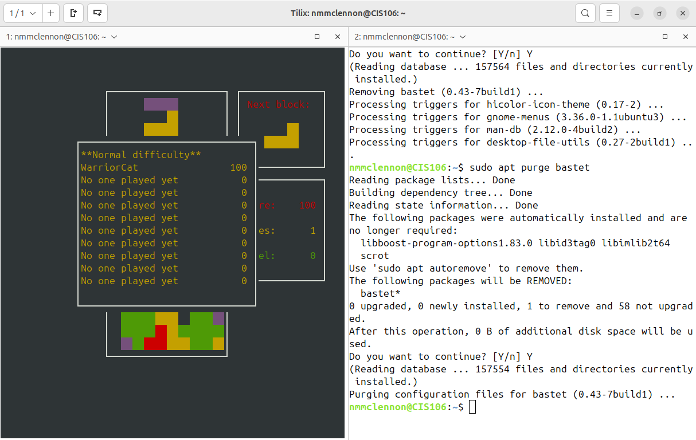
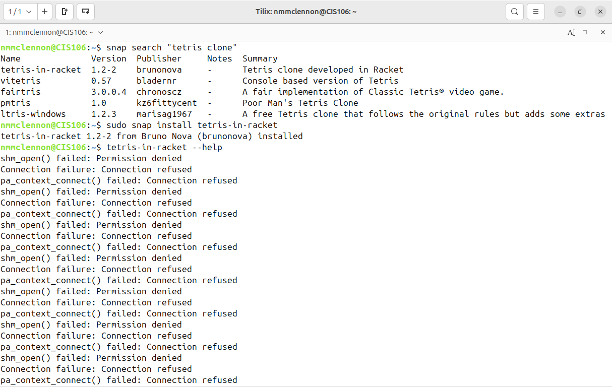

# Week Report 3
## Completed work for week 3
* [lab 3](../../labs/lab3/lab3.md)
* [Notes 3](../../notes/notes3/notes3.md)
  
## Practice 2: Accessing the Bash Shell

## Practice 3: Using the command history

## Practice 4: My First Shell Script

## Practice 5: Using man

## Practice 6:Using the help option

## Practice 7: Cheat!

## Practice 1: Managing Software

## Practice 3: Managing Software
